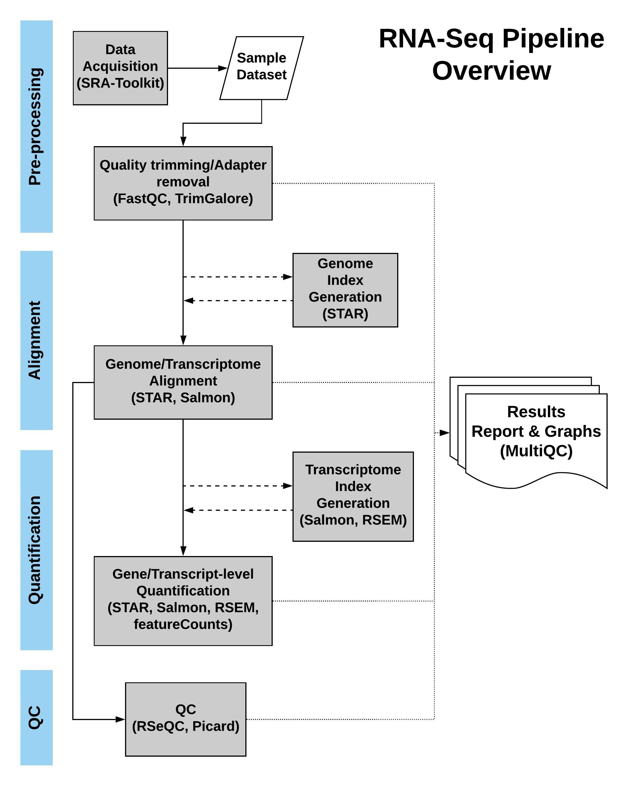

# DIANA-RSeq
DIANA-RNA-Seq-pipeline (DIANA-RSeq) is a fully automated computational RNA-Seq analysis pipeline that allows for RNA quantification through a modular, scalable and easy to use multi-option tool. It aims to streamline and automate the RNA analysis process from raw RNA-Seq data to quantified expression results. The tool is composed of multiple standalone modules that comprise the data acquisition, pre-processing, alignment, quantification and quality control steps of the analysis. 

The alignment and the quantification modules provide multiple options on the software utilized, allowing for flexibility and choice in the balance between quality and required computational time. Among the options, the analysis using the Salmon software is suggested for well annotated organisms as a computationally cheap and reliable approach, while the use of STAR aligner coupled with RSEM is suggested for a more thorough but also slower analysis approach followed by major organizations such as ENCODE.



The tool has been developed using Snakemake and utilizes Conda to eliminate the dependency installation. It is free to use under MIT licencse on Unix based systems.

DIANA-RSeq was funded by “**ELIXIR-GR: The Greek Research Infrastructure for Data Management and Analysis in Life Sciences**” (MIS 5002780) which is implemented under the Action “**Reinforcement of the Research and Innovation Infrastructure**”, funded by the Operational Programme “**Competitiveness, Entrepreneurship and Innovation**” (NSRF 2014-2020) and co-financed by Greece and the European Union (European Regional Development Fund).

## INSTALLATION
Installation of DIANA-RSeq is composed of three simple steps:
1. Download DIANA-RSeq through this reposiroty and uncompress it.
2. Install Conda on your system by following the [Conda Installation Guide](https://docs.conda.io/projects/conda/en/latest/user-guide/install/index.html).
3. Create a new Conda Environment and install Snakemake in it.
   1. Create a new Conda Environment: `conda create --name diana_rseq`
   2. Activate the new environment with: `conda activate diana_rseq`
   3. Install Snakemake inside the new environment with: `conda install -c bioconda -c conda-forge snakemake`
   4. Install Mamba dependency installer with: `conda install -c conda-forge mamba` and you are now ready to run your analysis!


## CONFIGURATION
DIANA-RSeq is accompanied by two configuration files located inside the "config" sub-folder:
1. The "samples.csv" file containing a sample_id column with the IDs of samples to be analyzed. (An example "samples.csv" file is located in the config folder)
2. The "config.yml" file containing all the configuration options available to the pipeline in general as well as the specific modules.

For your first analysis run a few parameters need to be adjusted accordingly in the "config.yml" file.
Please make sure to at least:
1. Adjust the _result_dir_ and _data_dir_ directories for your prefered output and input/download locations respectively
2. If your data contain an adapter, adjust the _trim_options_ parameter to include " -a {ADAPTER_SEQUENCE} " providing the actual adapter sequence to be trimmed
3. Select the prefered _aligner_, _quantifier_ tools from the available options
4. Provide an _alignment_index_dir_ containing the genome index created using the selected _aligner_ (even an empty directory if you have no index to provide, so that the index is created in this directory)
5. Provide an _annotation_file_
6. If you have no index, provide the genome_fasta and genome_sizes_file (info on how to create one can be found on the [Alignment module](#alignment-module)). We propose the use of [Gencode genome and annotation for human data analysis](https://www.gencodegenes.org/human/).

The general configuration options include:
- The absolute or relative (from Snakefile) directory of the "samples.csv" file, the results directory where the results are saved and finally the data directory where the sample data file inputs are expected to be.
- The fastq files information, such as their suffix and extentions, and also their layout whether they are Single or Paired-end. This information is only used when .fastq files are utilized for the analysis.

Information on the configuration options of individual modules can be found on each module below.
Both configuration files are validated through schemas. For more information see the appropriate schema file under the "workflow/schemas" directory.


**Warning:**</br>
Due to the very big size of the data that are usually analysed, DIANA-RSeq deletes a number of intermediate result files once they are no longer required by remaining analysis steps/rules.</br>
The _**trimmed .fastq files**_ and _**all .bam files**_ are progressively deleted throughtout the analysis. If you wish to override this directive and keep these files after the end of the analysis (it will require a lot of extra disk space) please add the "**--notemp**" flag when running the snakemake analysis command e.g.:

`snakemake --use-conda --notemp --cores {number_of_cores}`

## USAGE
Open a new terminal located inside the DIANA-RSeq directory.

Test everything is working correctly using the command:

`snakemake --use-conda -n`

The above command executes a "dry-run" only showing the Snakemake rules that will be run without actually running them (see [Snakemake documentation](https://snakemake.readthedocs.io/en/stable/index.html) for more on dry-runs).

Once you have made the proper configurations explained below, run your analysis using the command below by providing the desired number of cores to be utilized:

`snakemake --use-conda --cores {number_of_cores}`

## MODULES

### Data Acquisition Module
The Data Acquisition module utilizes the SRA-tools software to automatically download the fastq files of SRA samples using their sample-IDs provided in the "samples.csv" file.

**Software Used:**
SRA-tools (2.10.1)

**Configuration Options:**
```
getdata: true  # Flag to perform the Data Acquisition step using SRA-tools or not. This step will download the samples from SRA in the data_dir

getdata_options: "-X 50000" # Optional parameters for SRA-tools (v2.10.1), for available options please visit the SRA-tools documentation
```

**Expected input:** sample_id from "samples.csv" file

**Expected output:** Downloaded .fastq file(s) inside the data directory provided in the Configuration file

</br>

### Pre-processing Module
The Pre-processing module performs a quality check on the raw fastq files and generates a summary report using MultiQC. Following that, TrimGalore is employed to trim a provided adapter (or identify and trim one of the commonly used adapters) while also trim reads using a quality cutoff. Finally, a quality check if performed on the trimmed data and a MultiQC preprocessed summary report is generated.

**Software Used:**
FastQC (0.11.9), TrimGalore! (0.6.6), Cutadapt (3.3), MultiQC (1.10)

**Configuration Options:**
```
preprocess: true # Flag to perform the Pre-process step or not.

trim_options: "--quality 10 --length 20 --consider_already_trimmed 10" # optional parameters for TrimGalore (v0.6.6), for available options please visit the TrimGalore documentation. For specific adapter removal, add the -a flag in the options above eg.: -a TCGATTGAACGGT
```

**Expected input:**
- Single-End: {data_dir}/{sample_id}.{fqsuffix}.gz
- Paired-End: {data_dir}/{sample_id}\_{fqext1}.{fqsuffix}.gz , {data_dir}/{sample_id}\_{fqext2}.{fqsuffix}.gz

(sample_id from "samples.csv" file, data_dir-fqext1/2-fqsuffix from Configuration file)

**Expected output:** FastQC data from raw files, MultiQC raw summary report, TrimGalore trimmed files and trimming report, FastQC data from trimmed files, MultiQC preprocessed summary report, Logs for all the above

</br>

### Alignment Module
The Alignment module maps the input files to a provided genome reference file. It uses the STAR aligner software and also generates a STAR index of the reference genome in case an index is not found in the appropriate directory provided in the configuration file. In order to improve the required computational time the module utilizes STAR's shared-genome-index option, loading the index on the computer's RAM only once thus avoiding index loading times for multiple alignments (about 35GB of RAM are required for loading a typical Human genome, see STAR's documentation for more info). Bam alignment files for both genome and transcriptome are generated and the genome aligned bam files are also sorted using the Samtools software.

_Please note that if the STAR index is provided, **it must have been created using the exact same reference genome and annotation provided** through the configuration for the rest of the analysis._

**Software Used:**
STAR (2.7.8a), Samtools (1.12)

**Configuration Options:**
```
alignment: true # Flag to perform the Alignment step or not.

aligner: star # Available options= [star]
alignment_index_dir: /path/to/star/index/directory
genome_assembly: GRCh38 # The name of the assembly used e.g. "GRCh38". This will be used in naming for distinction puproses on the result files
annotation_file: /path/to/annotation/file # Uncompressed (.gtf/.gff3). Please provide a .gtf wherever possible. Tested with Gencode, Ensembl and RefSeq annotations.
align_params: " " # Aligner specific parameter options, please refer to the aligner documentation for available options

# Parameters for index generation. If an index is not found in the alignment_index_dir, an "/{genome_assembly}-{aligner}_index" subdirectory will be created and these will be used to generate one using the provided aligner
genome_fasta: /path/to/genome/fasta/file.fa
genome_sizes_file: /path/to/genome/sizes/file.fa.fai # Provide the .sizes or .fai genome file containing chromosome/contig sizes 
genome_index_params: "--limitGenomeGenerateRAM 50000000000 --genomeSAsparseD 1" # Aligner specific parameter options for alignment index generation, please refer to the aligner documentation for available options
```

Note: In case a sizes file is not present with your genome fasta file, you can create one from the genome fasta file using the Samtools software with the command below:

`samtools faidx {genome_fasta_file}`

**Expected input:**
- Single-End: {data_dir}/{sample_id}.{fqsuffix}.gz
- Paired-End: {data_dir}/{sample_id}\_{fqext1}.{fqsuffix}.gz , {data_dir}/{sample_id}\_{fqext2}.{fqsuffix}.gz

(sample_id from "samples.csv" file, data_dir-fqext1/2-fqsuffix from Configuration file)

**Expected output:** STAR Index files for the reference genome (if not provided), Bam alignment files on both genome and transcriptome for each sample input, Logs for all the above

</br>

### Quantification Module
The Quantification module infers the strandedness of each sample input and employes one of: Salmon, RSEM, featurecounts and STAR softwares to quantify the gene-level (and transcript-level for RSEM and Salmon) expression values of each sample. The quantifiers RSEM and Salmon also require an index which will be automatically created, using the provided reference genome and annotation, if not found in the appropriate directory provided in the configuration file.

When using the Salmon option, if the Alignment module is included in the analysis (alignment = true), Salmon is using the alignment-based mode which quantifies the output .bam files from the Alignment module (in this mode a Salmon index is not required). If the Alignment module is set to false, Salmon is used in mapping-mode which utilizes Salmon's fast alignment followed by quantification (in this mode a Salmon index is required and if not provided, a decoy-aware index is generated using the genome_fasta and the annotation_file).

_Please note that if an index is provided, **it must have been created using the exact same reference genome and annotation provided** through the configuration for the rest of the analysis._

**Software Used:**
UCSC-gtfToGenePred (377), UCSC-gff3ToGenePred (377), UCSC-genePredToBed (377), RSeQC (3.0.1), Subread (2.0.1), RSEM (1.3.3), Salmon (1.4.0), Bedtools (2.28), Mashmap (2.0), gffread (0.12.1), bioconductor-tximport (1.18), bioconductor-genomicfeatures (1.42.2), R (4.0.3), R-readr (1.4.0)

**Configuration Options:**
```
quantification: true # Flag to perform the Quantification step or not.

quantifier: salmon # Available options= [featurecounts, rsem, star, salmon]  (the "star" option is only available in conjunction with the execution of the alignment module using the aligner "star", moreover the quant_params are not used with this option)
quant_params: " " # Quantifier specific parameter options, please refer to the quantifier documentation for available options
quant_index: /path/to/quantifier/index/directory # (ONLY used by quantifiers RSEM and Salmon) Quantification index directory, RSEM also requires the index prefix in this parameter (e.g. /path/to/quantifier/index/directory/prefix). If the quantifier requires an index and it is not detected here, it will be created using annotation_file and genome_fasta. If provided, it must have been created using the exact same genome and annotation files used for the alignment index to avoid biased/incorrect results.
```

**Expected input:** {data_dir}/{sample_id}.bam  (sample_id from "samples.csv" file, for RSEM please provide an appropriate aligned-to-transcriptome .bam file)

**Expected output:** Converted .bed file from the annotation file provided, Inferred strandedness report for each input sample, Quantifier Index files for the reference genome (if not provided), Gene-level (and Transcript-level for RSEM and Salmon) quantification files, Logs for all the above

</br>

### Quality Control Module
The Quality Control module provides a number of quality control information about each sample. Namely it provides alignment file (.bam) statistics, read duplication check and marking, read distribution, read inner distance, junction saturation and annotation.

_Please note that this module requires an aligned-to-genome .bam file in order to produce the statistics. Therefore please set the "afterqc" option to false when using Salmon in mapping-mode (see Quantification module description) as it does not produce such an output._

**Software Used:**
Picard (2.25.1), RSeQC (3.0.1)

**Configuration Options:**
```
afterqc: true # Flag to perform the After QC step or not.

junction_analysis: true # Perform Junction-Annotation and -Saturation analysis using RSeQC (v3.0.1), please refer to RSeQC's documentation for more information
annotation_bed_file: /path/to/bed-12/annotation/file.bed # A 12-column BED file from the exact annotation used in the samples' upstream analysis. If quantification module is executed a .bed file is automatically generated from the annotation file given, otherwise please provide an annotation .bed file for the QC analysis (ucsc-gtftogenepred/ucsc-gff3togenpred + ucsc-genepredtobed are proposed for a GTF/GFF3 conversion to a proper 12-column bed file) (required for Read_distribution, Inner_distance and Junction analyses)
```

**Expected input:** {data_dir}/{sample_id}.bam  (sample_id from "samples.csv" file, please provide a sorted aligned-to-genome .bam file)

**Expected output:** Picard marked duplicates statistics, Bam file statistics, Read duplication statistics, Read distribution statistics, Junction saturation statistics (only if junction_analysis is true), Junction annotation statistics (only if junction_analysis is true), Read inner distance statistics (only for Paired-end samples), Logs for all the above

</br>

### Summary Report
A summary report html file is generated at the end of every analysis regardless of the modules used. We utilize MultiQC (1.10) to create graphs from almost all the analysis steps performed, providing a quick overview of the results with advanced filtering capabilities. Please visit the [MultiQC documentation](https://multiqc.info/docs/#using-multiqc-reports) for further information.


## OUTPUT
DIANA-RSeq produces numerous outputs, some of which will be automatically deleted throught the analysis progress so as to preserve disk space (see the [**CONFIGURATION**](#configuration) section). The complete list of output files produced are organized in the following structure:

**{results_directory}/**
- preprocess/ &emsp;&emsp;&emsp;&emsp;&emsp;&emsp;&emsp;&emsp;
   - fastq_trimmed/ &emsp;&emsp;&emsp;&emsp;&emsp;&emsp;&emsp;&emsp;(the trimmed .fastq files produced by TrimGalore)
   - fastqc_data/ &emsp;&emsp;&emsp;&emsp;&emsp;&emsp;&emsp;&emsp;(the data produced by FastQC for each sample, organized in "raw" and "trimmed" folders)
   - fastqc_reports/ &emsp;&emsp;&emsp;&emsp;&emsp;&emsp;&emsp;&emsp;(the FastQC reports for each sample, organized in "raw" and "trimmed" folders)
   - trimming_reports/ &emsp;&emsp;&emsp;&emsp;&emsp;&emsp;&emsp;&emsp;(the TrimGalore/Cutadapt trimming reports for each sample)
- alignment/ &emsp;&emsp;&emsp;&emsp;&emsp;&emsp;&emsp;&emsp;
   - {aligner}/
      - {genome-assembly}-{sample}/ &emsp;&emsp;&emsp;&emsp;&emsp;&emsp;&emsp;&emsp;(a folder for each sample with the genome_assembly prefix)
         - _.bam and other files_ by the {aligner} software
         - _*markedDuplicates.bam_ by Picard (only if the Quality Control module is invoced in the analysis)
         - _*strandedness-infer_experiment.txt_ by RSeQC (only if the Quantification module is invoced in the analysis)
- quantification/ &emsp;&emsp;&emsp;&emsp;&emsp;&emsp;&emsp;&emsp;
   - annotation_bed/ &emsp;&emsp;&emsp;&emsp;&emsp;&emsp;&emsp;&emsp;(a folder that contains the .bed file created from the annotation_file)
   - {quantifier}/
      - {genome-assembly}-{sample}/ &emsp;&emsp;&emsp;&emsp;&emsp;&emsp;&emsp;&emsp;(a folder for each sample with the genome_assembly prefix)
         - _*.genes.results_ containing the gene-level quantification results for the sample
         - _*.transcripts.results_ containing the transcript-level quantification results for the sample (only available for Salmon and RSEM quantifier options)
         - other {quantifier}-specific result files for the sample
- afterqc/ &emsp;&emsp;&emsp;&emsp;&emsp;&emsp;&emsp;&emsp;
   - picard/ &emsp;&emsp;&emsp;&emsp;&emsp;&emsp;&emsp;&emsp;(a _*marked_duplicates_metrics.txt_ file for each sample)
   - rseqc/
      - {sample}/ &emsp;&emsp;&emsp;&emsp;&emsp;&emsp;&emsp;&emsp;(a folder for each sample)
         - RSeQC result files for the sample
- intermediate/ &emsp;&emsp;&emsp;&emsp;&emsp;&emsp;&emsp;&emsp;(folder containing the multiQC software data required for the summary reports)
- logs/ &emsp;&emsp;&emsp;&emsp;&emsp;&emsp;&emsp;&emsp;
- analysis_rulegraph.png &emsp;&emsp;&emsp;&emsp;&emsp;&emsp;&emsp;&emsp;(an analysis workflow graph depicting the snakemake rules order of execution and interconnection)
- multiqc_raw.html &emsp;&emsp;&emsp;&emsp;&emsp;&emsp;&emsp;&emsp;(the multiQC report for the raw .fastq files produced by the Pre-processing Module)
- multiqc_preprocess.html &emsp;&emsp;&emsp;&emsp;&emsp;&emsp;&emsp;&emsp;(the multiQC report for the pre-processed .fastq files produced by the Pre-processing Module)
- multiqc.html &emsp;&emsp;&emsp;&emsp;&emsp;&emsp;&emsp;&emsp;(the overall multiQC summary report for the Alignment, Quantification and Quality Control modules)
